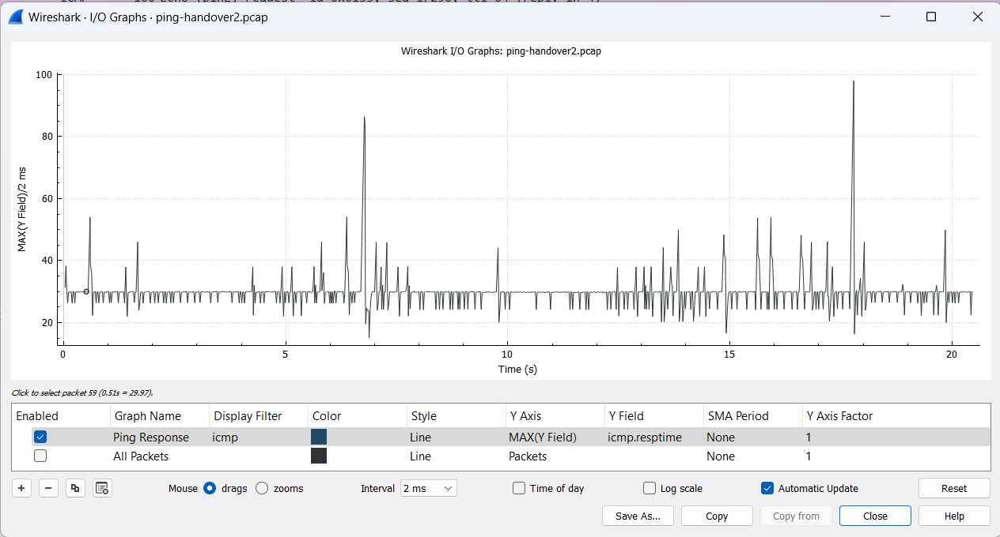
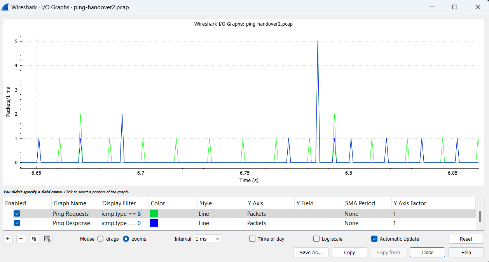

# Ping test

## Reponse Time
Commands ran:
```
EPC$ ping -n -i 0.01 $UE_IP_ADDRESS
...
--- 10.45.0.3 ping statistics ---
1198 packets transmitted, 1197 received, +2 duplicates, 0.0834725% packet loss, time 20422ms
rtt min/avg/max/mdev = 14.284/28.620/100.259/6.943 ms, pipe 7
```
```
EPC$ tcpdump -i any -w ping-handover.pcap icmp
```
Wireshark output:


## Dropped Packets
