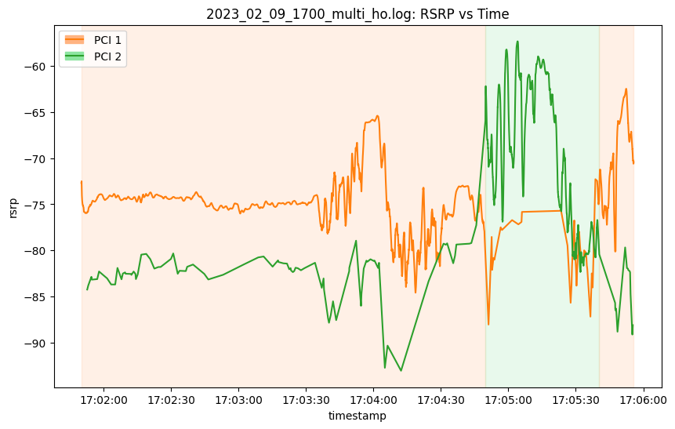
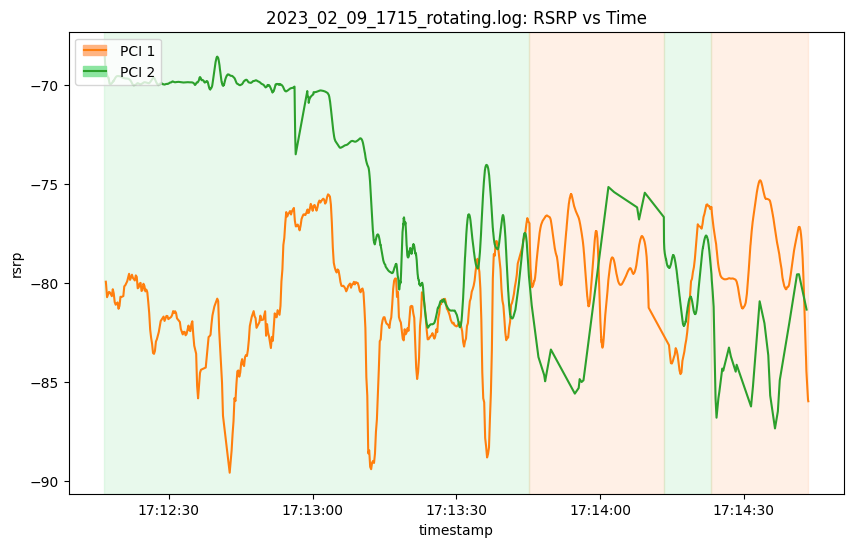
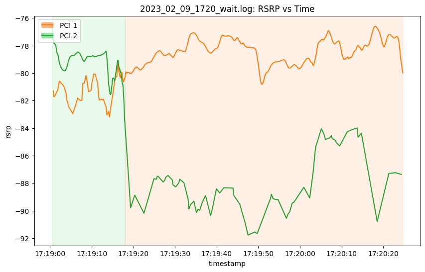
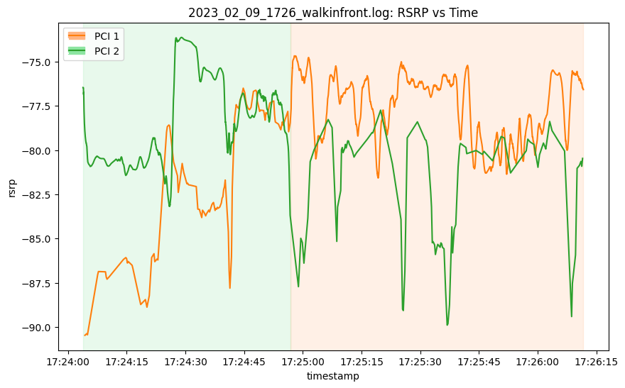

Walking from the end of the room to the other end, the UE is handed over from one eNB to another, and then walking back to the starting position. The handover is triggered by the UE's RSRP falling below a certain threshold. The handover is successful and the UE continues to communicate with the new eNB.

The UE is initially placed in the centre of the room on a chair. The chair is slowly rotated from facing on eNB to the other and back in a steady rhythm. The UE is handed over from one eNB to another, and then back to the original eNB multiple times in a Ping-Pong fashion. This highlights the instability of the algorithm.

The UE is initially placed in the centre of the room on a chair. Once the experiment has been started, and everything stabilises, the UE is left in a static environment. This plot highlights the instability of the signal strength.

The UE is initially placed in the centre of the room on a chair. Once the experiment has been started, and everything stabilises, the author walks in front of the chair - aiming to block LOS between the UE and the eNB. This plot highlights the relatively large impact of people in the environment affecting the signal strength.
