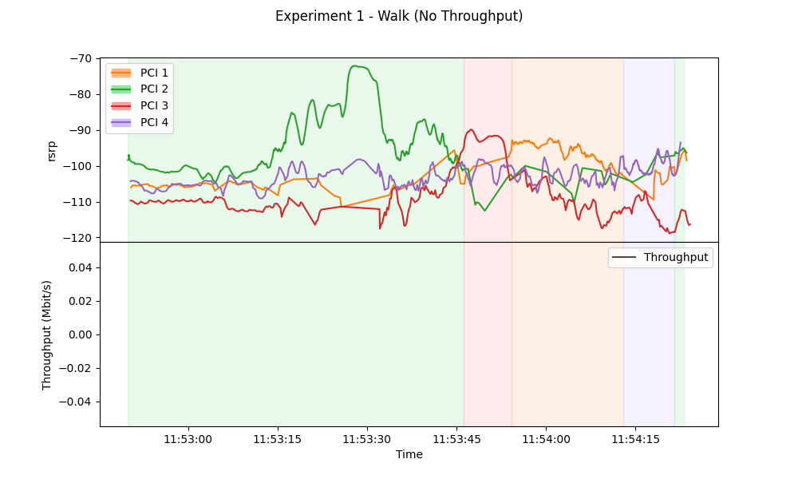
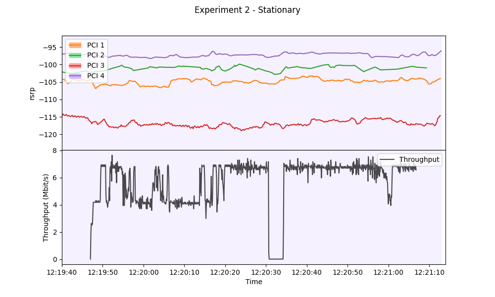
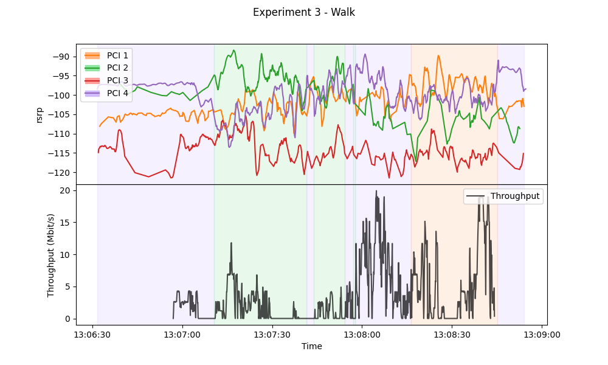
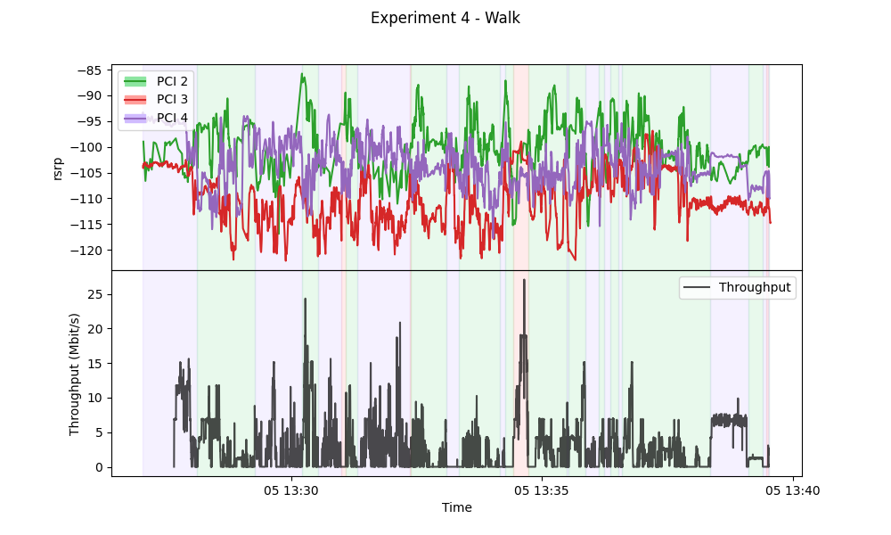
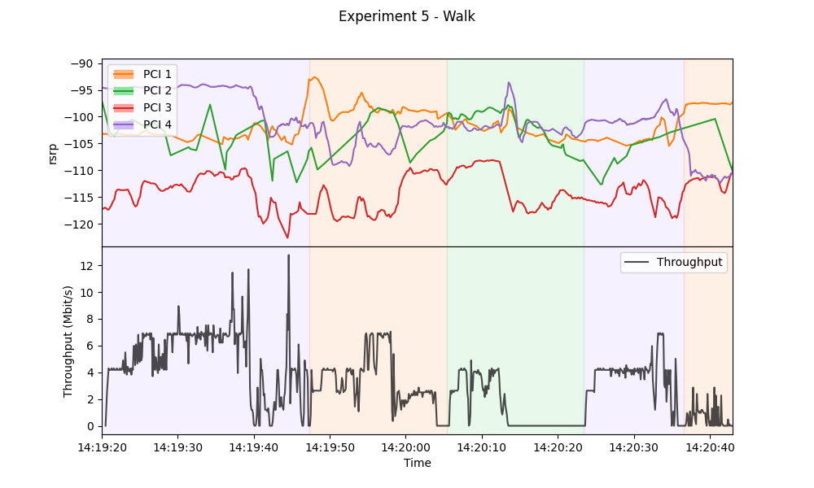

# 4-EnB Setup
## Experiment 1
- Showcases frequent handovers occuring.
- No throughput data available
- Walked back and forth between one sides of the room to the other.

## Experiment 2
- Showcases relative stability of the network, but instability of the throughput.
- Kept device and room static

## Experiment 3
- Showcases frequent handovers, as well as very unstable datarate
- Walked around room in a sporadic manner

## Experiment 4
- Longer 15 minute experiment
- PCI 1 dropped off
- Walked around room in a sporadic manner

## Experiment 5
- Another shorter experiment with all 4 enbs
