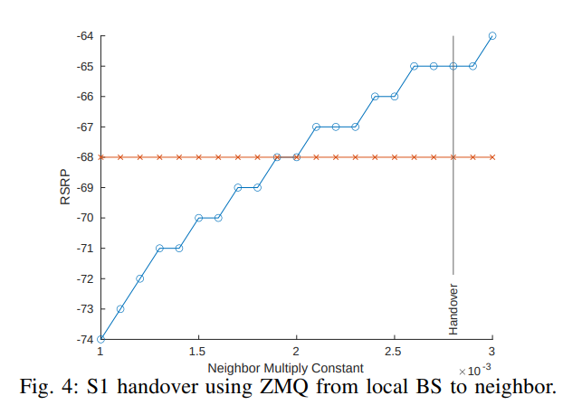
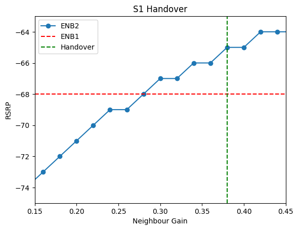

# Experiment 00
Followed [this](https://docs.srsran.com/projects/4g/en/hoverxref_test/app_notes/source/handover/source/index.html#s1-handover) srsRAN tutorial to perform an S1 handover

## Running Tests
1. Copy `configs/` to `~/.config/srsran/`.
2. Run the enb1, enb2 and ue (see srsRAN/README.md file). This is simplified if you have a tmux session named `main` with a pane named `nodes`. This allows you to run `start_nodes.sh` (and variants) and `stop_nodes.sh`. This does not start the grc.
3. Start gnuradio with `uav_experiments.grc`, OR compile to python with `grcc uav_experiments.grc` and run with `python3`

## Test 1 (using rr_enb1.conf and rr_enb2.conf)
1. Set enb1 multiply constant to a value such that the connected ue gives a `-68dBm` RSRP.
2. Increment the enb2 multiply constant, noting down its Neighbour RSRP given by the UE
3. Note when handover occurs.
4. Save the data in a csv, and run `Graph.ipynb`

### Results
As with the paper @powellHandoverExperimentsUAVs2021, handover occurs when the neighbour RSRP is 3dB higher than the serving RSRP. This leads us to conclude that the standard hyteresis margin is 3dB in srsRAN.

#### Handover Experiments Paper Figure 4:

#### Personal Results


## Test 2 (updating `hysteresis` key)
**Hypothesis:** The `hysteresis` filed in the rr.conf files sets the hysteresis of the enb nodes
1. Create `rr_enb(1|2)_hyst(1|5).conf` files, with the only change being setting the hysteresis value to `1` and `5` respectively
1. Set enb1 multiply constant to a value such that the connected ue gives a `-68dBm` RSRP.
2. Increment the enb2 multiply constant, noting down its Neighbour RSRP given by the UE
3. Note when handover occurs.
4. Save the data in a csv, and run `Graph.ipynb`

### Results
In the case where `hysteresis` is 1, handover still only occures when neighbour is 3dB higher.
In the case where `hysteresis` is 5, handover occures at a 5dB margin.

**New Hypothesis:** Handover occures at 3dB, or the `hysteresis` value, whichever is higher. 

## Test 3 (changing source)
**Hypothesis:** In the code there must be a 3dB offset to the added `hysteresis` value
We are specifically looking at an A3 event. In the srsRAN_4G codebase, we find this code:

*srsue/src/stack/rrc/rrc_meas.cc:864*
```cpp
case eutra_event_s::event_id_c_::types::event_a3:
    Off             = 0.5 * event_id.event_a3().a3_offset;
    enter_condition = Mn + Ofn + Ocn - hyst > Ms + Ofs + Ocs + Off;
    exit_condition  = Mn + Ofn + Ocn + hyst < Ms + Ofs + Ocs + Off;
    break;
```
Here we can see there are multiple confounding variables. Variables suffixed with n are related to the target cell, -s related to source cell. Of is a frequency specific offset, and Oc is a cell specific offset. To determine which of the variables is at play, `Off` the A3 offset is set to zero (`Off = 0;`) and Test 1 is reran

### Results
We now see handover occuring the moment the target cell has a higher RSRP. On further examination, the A3 offset is specified in the `rr.conf` file under `a3_offset = 6`. What is not currently understood is why the offset is halved in the code, along with the Hysteresis on line 794
```
double hyst = 0.5 * report_cfg.trigger_type.event().hysteresis;
```
Furthermore, the code seems to exist in the `srsue` component, however handover is triggered by the enb. To investigate further.

This disproves previous hypotheses, and can confirm that the handover occurs when
$$\text{RSRP}_\text{Target} - \text{RSRP}_\text{Source} \gt \text{Hysteresis} + \text{A3 Offset} + \text{Of} + \text{Oc}$$

where 
$$\begin{aligned}\text{Of} &= \text{Frequency Offset}_\text{Target} - \text{Frequency Offset}_\text{Source} \\
\text{Oc} &= \text{Cell Offset}_\text{Target} - \text{Cell Offset}_\text{Source}\end{aligned}$$
for the default setup, $\text{Of}=0$ and $\text{Oc}=0$

For the rest of the project, we will assume that A3 Offset, Of, and Oc are set to zero (or included in Hysteresis).

- [] TODO: Use cell specific offsets in the ML network outputs


# Bibliograph
[1] K. Powell, A. Yingst, T. F. Rahman, and V. Marojevic, ‘Handover Experiments with UAVs: Software Radio Tools and Experimental Research Platform’, in Proceedings of the 15th ACM Workshop on Wireless Network Testbeds, Experimental evaluation & CHaracterization, in WiNTECH’21. New York, NY, USA: Association for Computing Machinery, Oct. 2021, pp. 39–45. doi: 10.1145/3477086.3480841.
