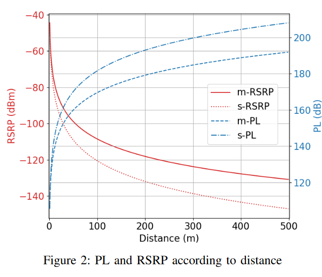
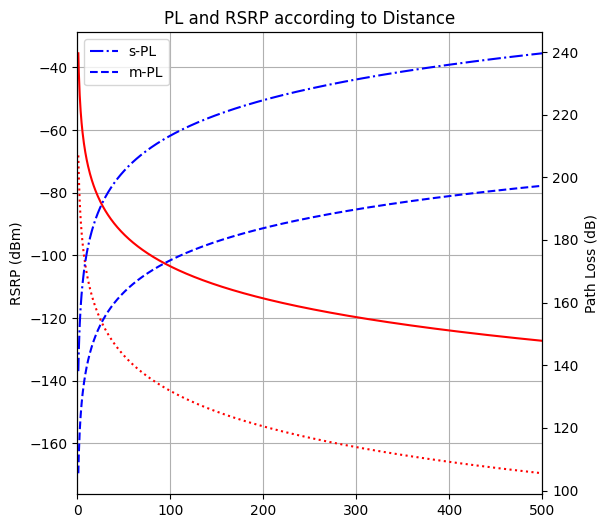

# Introduction
This experiment follows @hatipogluHandoverbasedLoadBalancing2020 to attempt to replicate their findings

# Recreating propogation loss function
In `propogation_loss.ipynb` we attempt to recreate Figure 2. As T_P and T_G are not given, I have estimated them by referencing the difference in the graphs to have a sum of 70dB

**Paper Result**

**Recreated Result**

# References
[1] A. Hatipoğlu, M. Başaran, M. A. Yazici, and L. Durak-Ata, ‘Handover-based load balancing algorithm for 5G and beyond heterogeneous networks’, in 2020 12th international congress on ultra modern telecommunications and control systems and workshops (ICUMT), Oct. 2020, pp. 7–12. doi: 10.1109/ICUMT51630.2020.9222456.
